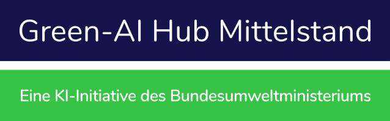

<a name="readme-top"></a>


<br />
<div align="center">
  <h1 align="center">Retrieval Augmented Generation (RAG) Demonstrator</h1>
  
  <p align="center">
    <a href="https://github.com/Green-AI-Hub-Mittelstand/LLM-Demonstrator/issues">Report Bug</a>
    ·
    <a href="https://github.com/Green-AI-Hub-Mittelstand/LLM-Demonstrator/issues">Request Feature</a>
  </p>

  <br />

  <p align="center">
    <a href="https://www.green-ai-hub.de">
    
  </a>
    <br />
    <h3 align="center"><strong>Green-AI Hub Mittelstand</strong></h3>
    <a href="https://www.green-ai-hub.de"><u>Homepage</u></a> 
    | 
    <a href="https://www.green-ai-hub.de/kontakt"><u>Contact</u></a>
  
   
  </p>
</div>

<br/>

## About The Project

This demonstrator was developed by the German Research Center for AI (DFKI) as part of the Green-AI Hub Mittelstand funded by the German ministry of Federal Ministry for the Environment, Nature Conservation, Nuclear Safety and Consumer Protection of Germany and managed by the "Zukunft - Umwelt - Gesellschaft" (ZUG). <br/><br/>
We developed this software to show to all kinds of SMEs that LLMs can easily be deployed for custom use cases without having to rely on big and sometimes expensive cloud hosted LLMs. At the same time, this software demonstrates that LLMs can be deployed without causing a massive carbon footprint in the form of an expensive Deep-Learning-Server, as this software can be deployed easily on a current MacBook Pro.
### Features

- RAG implementation using the mps back-end from apple or cuda (upcoming) for nvidia GPUs
- Web interface for easy interaction with the RAG system
- Interface to add custom wikipedia articles to knowledge base
- Customizable knowledge base for retrieval
- Performance metrics and comparisons

### Why RAG?

Retrieval Augmented Generation offers several advantages over traditional fine-tuning approaches, particularly from a sustainability perspective:

1. Reduced computational resources: RAG doesn't require retraining the entire model, significantly reducing the computational power needed compared to fine-tuning.

2. Lower energy consumption: With less computation required, RAG consumes less energy, making it a more environmentally friendly option.

3. Easier updates: The knowledge base can be updated independently of the model, allowing for more frequent and efficient information updates without the need for resource-intensive retraining.

4. Smaller carbon footprint: The combination of reduced computation and energy usage results in a smaller overall carbon footprint for RAG systems.

5. Scalability: RAG can handle larger and more diverse knowledge bases without the exponential increase in model size and training time associated with fine-tuning.

By choosing RAG over fine-tuning, we can create more sustainable AI solutions that are both powerful and environmentally responsible.


<p align="right">(<a href="#readme-top">back to top</a>)</p>

## Table of Contents
<details>
  <summary></summary>
  <ol>
    <li>
      <a href="#about-the-project">About The Project</a>
    </li>
    <li><a href="#table-of-contents">Table of Contents</a></li>
    <li><a href="#getting-started">Getting Started</a></li>
    <li><a href="#usage">Usage</a></li>
    <li><a href="#contributing">Contributing</a></li>
    <li><a href="#license">License</a></li>
    <li><a href="#contact">Contact</a></li>
  </ol>
</details>


<p align="right">(<a href="#readme-top">back to top</a>)</p>


## Getting Started

Clone this repository, navigate with your terminal into this repository and execute the following steps.

### Prerequisites

Install the required software libraries for your local python environment.
  ```sh
  pip install -r requirements.txt
  ```
If you want to use the DeepL translation service for improved answer quality, you have to insert your API key in line 202 in app.py

### Starting the software

To use the demonstrator after you installed the required packages, you simply have to execute a few commands.

1. Navigate to the repository with your terminal.
2. Install the repository as a pip package
   ```sh
   python3 app.py
   ```
3. If successful, the terminal should show under which url:port the web interface is available.

Please note that the first start-up requires a connection to the internet and can take some time, as the LLM has to be downloaded first. Be aware that the downloaded files will be multiple Gigabytes in space.

<p align="right">(<a href="#readme-top">back to top</a>)</p>


## Usage

### How to Use the LLM RAG Demonstrator

The LLM RAG Demonstrator provides a web interface for comparing the outputs of a standard LLM (Language Model) with an LLM enhanced by RAG (Retrieval-Augmented Generation). Below are the steps to effectively use this demonstrator:

1. **Access the Demonstrator**:
   - Open your web browser and navigate to the previously provided URL for the LLM RAG Demonstrator.

2. **User Input**:
   - In the center of the page, you will find a text box labeled "User Input".
   - Enter your query or text prompt in this text box. This can be a question or a statement that you want the models to respond to.

3. **Submit the Query**:
   - After entering your input, click the green "Submit" button located below the text box.

4. **View Outputs**:
   - Once you submit your query, the page will display two sections for outputs:
     - **LLM Default Output**: This section shows the response generated by the standard LLM.
     - **LLM RAG Output**: This section shows the response generated by the LLM enhanced with Retrieval-Augmented Generation.
   - Both outputs will appear in designated boxes labeled "Output...".

5. **Compare Results**:
   - Compare the outputs from both sections to analyze the differences in responses.
   - The RAG-enhanced output should ideally provide more accurate and contextually relevant information due to the integration of retrieved documents or data.

<p align="center">
    
  </a>

## Developers

The overall concept of the demonstrator was developed by [Cornelius Wolff](mailto:cornelius.wolff@dfki.de), while the Front-End, the wikipedia feature and the retrieval process was developed by [Leonie Grafweg](mailto:leonie.grafweg@dfki.de).
 
## Contributing

Contributions are what make the open source community such an amazing place to learn, inspire, and create. Any contributions you make are **greatly appreciated**.

If you have a suggestion that would make this better, please fork the repo and create a pull request. You can also simply open an issue with the tag "enhancement".
Don't forget to give the project a star! Thanks again!

1. Fork the Project
2. Create your Feature Branch (`git checkout -b feature/AmazingFeature`)
3. Commit your Changes (`git commit -m 'Add some AmazingFeature'`)
4. Push to the Branch (`git push origin feature/AmazingFeature`)
5. Open a Pull Request

<p align="right">(<a href="#readme-top">back to top</a>)</p>


## License

Distributed under the MIT License. See the `LICENSE` file for more information.

<p align="right">(<a href="#readme-top">back to top</a>)</p>


## Contact

Green-AI Hub Mittelstand - info@green-ai-hub.de

Project Link: https://github.com/Green-AI-Hub-Mittelstand/LLM-Demonstrator

<br />
  <a href="https://www.green-ai-hub.de/kontakt"><strong>Get in touch »</strong></a>
<br />
<br />

<p align="left">
    <a href="https://www.green-ai-hub.de">
    
  </a>

<p align="right">(<a href="#readme-top">back to top</a>)</p>

